# Smart-Credit-Automating-Financial-Risk-Brackets-with-Predictive-Machine-Learning-Models

<!DOCTYPE html>
<html lang="en">
<head>
<meta charset="utf-8">
<meta name="viewport" content="width=device-width, initial-scale=1">
<title>Credit Score Classification API</title>

</head>
<body>
<h1 id="credit-score-classification-api">Credit Score Classification
API</h1>

A machine learning model that classifies a customer's credit score as
<strong>Poor</strong>, <strong>Standard</strong>, or
<strong>Good</strong> from their banking and credit data, served through
a REST API built with FastAPI.

This project was built as a final certification assignment: acting as
a data scientist at a global finance company, the goal is to turn raw
credit-related records into a reliable credit score classifier.

<h2 id="features">Features</h2>
<ul>
<li>Data cleaning and feature preparation for messy real-world bank
data</li>
<li>Comparison of several classifiers (Random Forest, XGBoost, LightGBM,
Logistic Regression)</li>
<li>Model explainability with feature importance and SHAP</li>
<li>REST API for single and batch predictions, returning class
probabilities</li>
<li>Interactive API docs (Swagger UI) out of the box</li>
<li>Optional Docker deployment</li>
</ul>
<h2 id="tech-stack">Tech Stack</h2>

Python, pandas, NumPy, scikit-learn, imbalanced-learn, XGBoost,
LightGBM, SHAP, FastAPI, Uvicorn

<h2 id="project-structure">Project Structure</h2>
<pre><code>.
├── Model.ipynb        # Data cleaning, EDA, model comparison, explainability
├── main.py            # FastAPI application
├── requirements.txt   # Python dependencies
├── train.csv          # Training data (not included in the repo, see below)
├── test.csv           # Test data (not included in the repo, see below)
└── model.joblib       # Trained model, created on first run</code></pre>
<h2 id="the-model">The Model</h2>

The notebook walks through the full workflow:

<ol type="1">
<li><strong>Cleaning:</strong> removes junk characters and placeholder
values, fixes impossible values, and fills gaps.</li>
<li><strong>EDA:</strong> distributions by credit class, categorical
breakdowns, and a correlation heatmap.</li>
<li><strong>Modelling:</strong> class imbalance is handled with SMOTE,
and four models are compared on validation macro F1 using a
customer-grouped train/validation split so the same customer never
appears in both sets.</li>
<li><strong>Explainability:</strong> feature importance, SHAP values,
and a confusion matrix show what drives each rating.</li>
</ol>

The model served by the API is a Logistic Regression classifier
(<code>C=0.1</code>, balanced class weights) trained on the full
training set with label-encoded categorical features and median
imputation, as in the final cell of the notebook.

<table>
<thead>
<tr class="header">
<th>Model</th>
<th>Validation Macro F1</th>
</tr>
</thead>
<tbody>
<tr class="odd">
<td>Add your results here</td>
<td></td>
</tr>
</tbody>
</table>
<h2 id="getting-started">Getting Started</h2>
<h3 id="prerequisites">Prerequisites</h3>
<ul>
<li>Python 3.12 or 3.13 recommended</li>
<li><code>train.csv</code> placed in the project root</li>
</ul>
<h3 id="installation">Installation</h3>

<pre
class="sourceCode bash"><code class="sourceCode bash">git clone https://github.com/&lt;your-username&gt;/&lt;your-repo&gt;.git
cd &lt;your-repo&gt;

python -m venv venv
venv\Scripts\activate          # Windows
# source venv/bin/activate     # Linux / macOS

pip install -r requirements.txt</code></pre>

<h3 id="run-the-api">Run the API</h3>

<pre
class="sourceCode bash"><code class="sourceCode bash">uvicorn main:app --reload</code></pre>

On the first start the model is trained from <code>train.csv</code>
and saved to <code>model.joblib</code>. Later starts load the saved
model. Set <code>RETRAIN=1</code> to force retraining.

The API runs at <code>http://127.0.0.1:8000</code>, and the
interactive docs are at <code>http://127.0.0.1:8000/docs</code>.

<h2 id="api-reference">API Reference</h2>
<table>
<thead>
<tr class="header">
<th>Method</th>
<th>Endpoint</th>
<th>Description</th>
</tr>
</thead>
<tbody>
<tr class="odd">
<td>GET</td>
<td><code>/health</code></td>
<td>Check that the service and model are loaded</td>
</tr>
<tr class="even">
<td>POST</td>
<td><code>/predict</code></td>
<td>Predict the credit score for one record</td>
</tr>
<tr class="odd">
<td>POST</td>
<td><code>/predict/batch</code></td>
<td>Predict for up to 1000 records at once</td>
</tr>
</tbody>
</table>

Fields you leave out are treated as missing and filled with the
training median.

<h3 id="example-request">Example request</h3>

<pre
class="sourceCode bash"><code class="sourceCode bash">curl -X POST http://127.0.0.1:8000/predict \
  -H &quot;Content-Type: application/json&quot; \
  -d &#39;{
    &quot;Month&quot;: &quot;January&quot;,
    &quot;Age&quot;: 28,
    &quot;Occupation&quot;: &quot;Scientist&quot;,
    &quot;Annual_Income&quot;: 19114.12,
    &quot;Monthly_Inhand_Salary&quot;: 1824.84,
    &quot;Num_Bank_Accounts&quot;: 3,
    &quot;Num_Credit_Card&quot;: 4,
    &quot;Interest_Rate&quot;: 3,
    &quot;Num_of_Loan&quot;: 4,
    &quot;Delay_from_due_date&quot;: 3,
    &quot;Num_of_Delayed_Payment&quot;: 7,
    &quot;Changed_Credit_Limit&quot;: 11.27,
    &quot;Num_Credit_Inquiries&quot;: 4,
    &quot;Credit_Mix&quot;: &quot;Good&quot;,
    &quot;Outstanding_Debt&quot;: 809.98,
    &quot;Credit_Utilization_Ratio&quot;: 26.82,
    &quot;Credit_History_Age&quot;: &quot;22 Years and 9 Months&quot;,
    &quot;Payment_of_Min_Amount&quot;: &quot;No&quot;,
    &quot;Total_EMI_per_month&quot;: 49.57,
    &quot;Amount_invested_monthly&quot;: 80.42,
    &quot;Payment_Behaviour&quot;: &quot;High_spent_Small_value_payments&quot;,
    &quot;Monthly_Balance&quot;: 312.49
  }&#39;</code></pre>

<h3 id="example-response">Example response</h3>

<pre
class="sourceCode json"><code class="sourceCode json">{
  &quot;credit_score&quot;: &quot;Standard&quot;,
  &quot;class_id&quot;: 1,
  &quot;probabilities&quot;: {
    &quot;Poor&quot;: 0.1832,
    &quot;Standard&quot;: 0.5127,
    &quot;Good&quot;: 0.3041
  }
}</code></pre>

The probabilities above are illustrative. Real values depend on the
trained model.

<h2 id="docker">Docker</h2>

<pre
class="sourceCode dockerfile"><code class="sourceCode dockerfile">FROM python:3.12-slim
WORKDIR /app

COPY requirements-api.txt .
RUN pip install --no-cache-dir -r requirements-api.txt

COPY main.py model.joblib ./

EXPOSE 8000
CMD [&quot;uvicorn&quot;, &quot;main:app&quot;, &quot;--host&quot;, &quot;0.0.0.0&quot;, &quot;--port&quot;, &quot;8000&quot;]</code></pre>

Run the app once locally first so <code>model.joblib</code> exists,
then:

<pre
class="sourceCode bash"><code class="sourceCode bash">docker build -t credit-score-api .
docker run -p 8000:8000 credit-score-api</code></pre>

<h2 id="data">Data</h2>

The dataset (<code>train.csv</code>, <code>test.csv</code>) contains
customer-month banking records with fields such as income, debt, number
of loans, payment delays, credit mix, and credit history age. The target
is <code>Credit_Score</code> (Poor, Standard, Good). The data files are
not included in this repository. Place them in the project root before
running.

<h2 id="notes-and-limitations">Notes and Limitations</h2>
<ul>
<li>The model is for learning and demonstration. It should not be used
to make real lending decisions.</li>
<li>Categories not seen during training are encoded as unknown, and
missing values are filled with the training median.</li>
<li>The model and the saved <code>model.joblib</code> should be built
with the same scikit-learn version you deploy with.</li>
</ul>
<h2 id="license">License</h2>

Add a license of your choice (for example MIT) and state it here.

<h2 id="author">Author</h2>

<strong>Mohsin Mubarok</strong>

</body>
</html>
#Exploratory Data Analysis

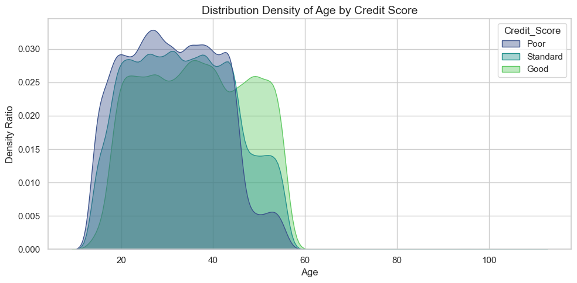
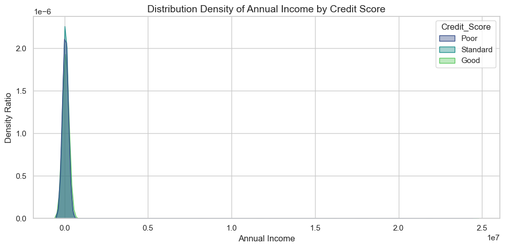
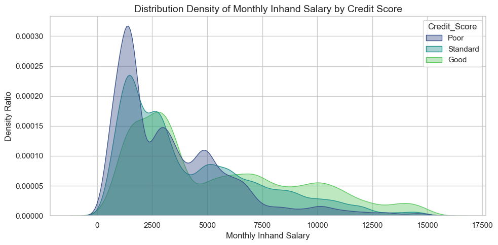
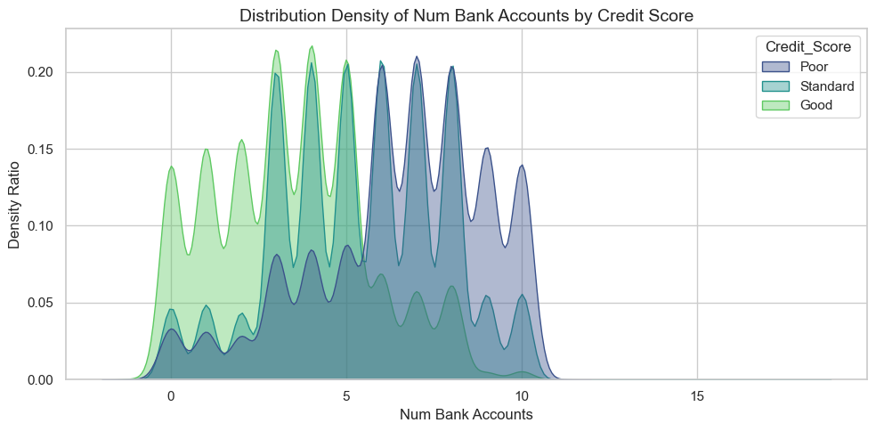
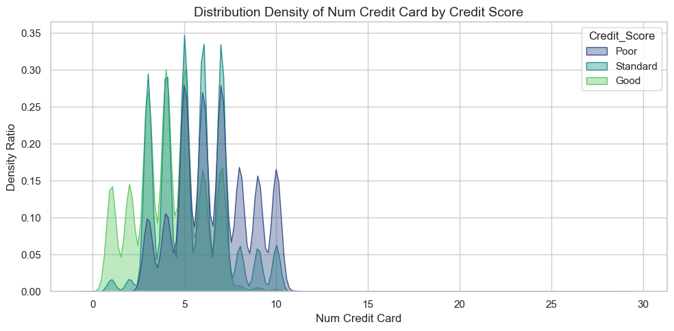
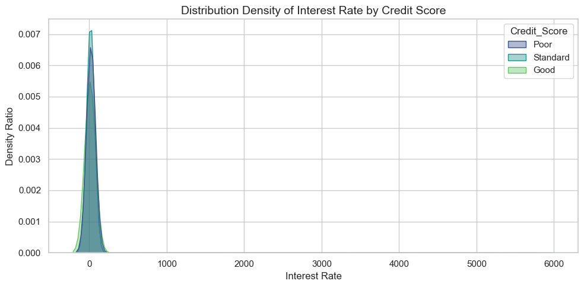
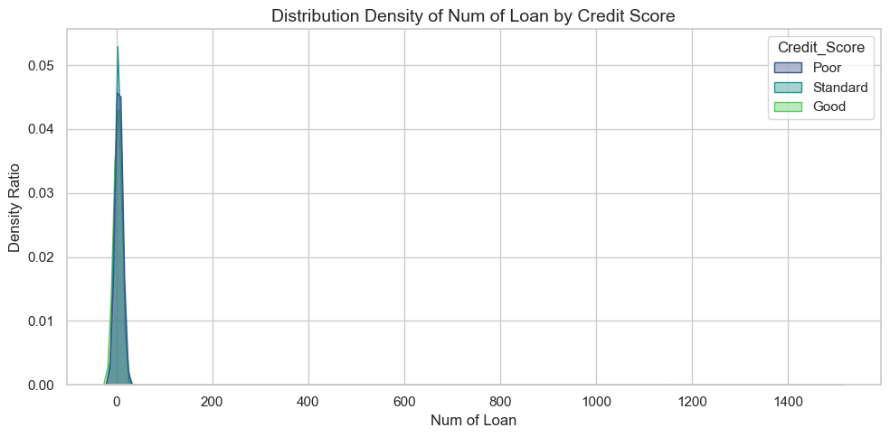
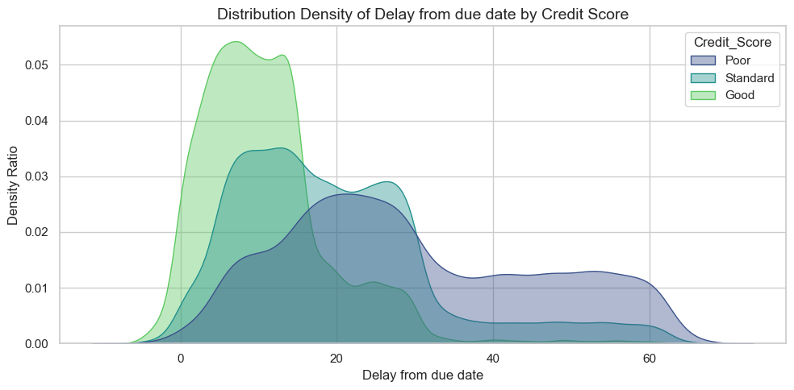
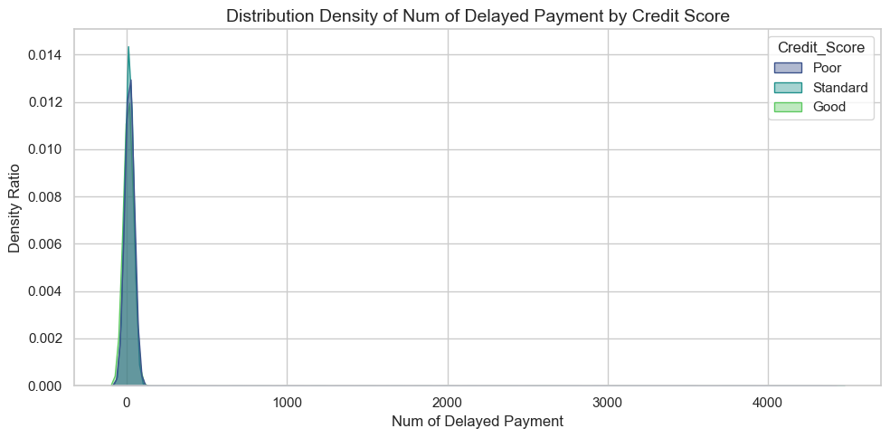
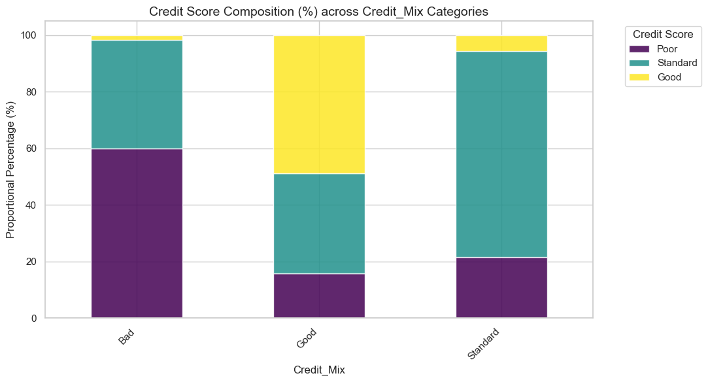
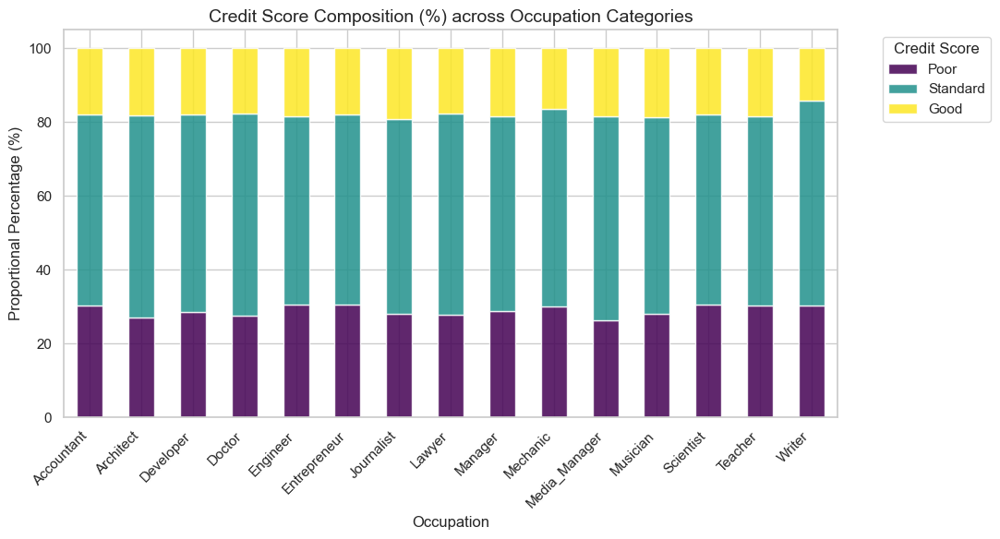
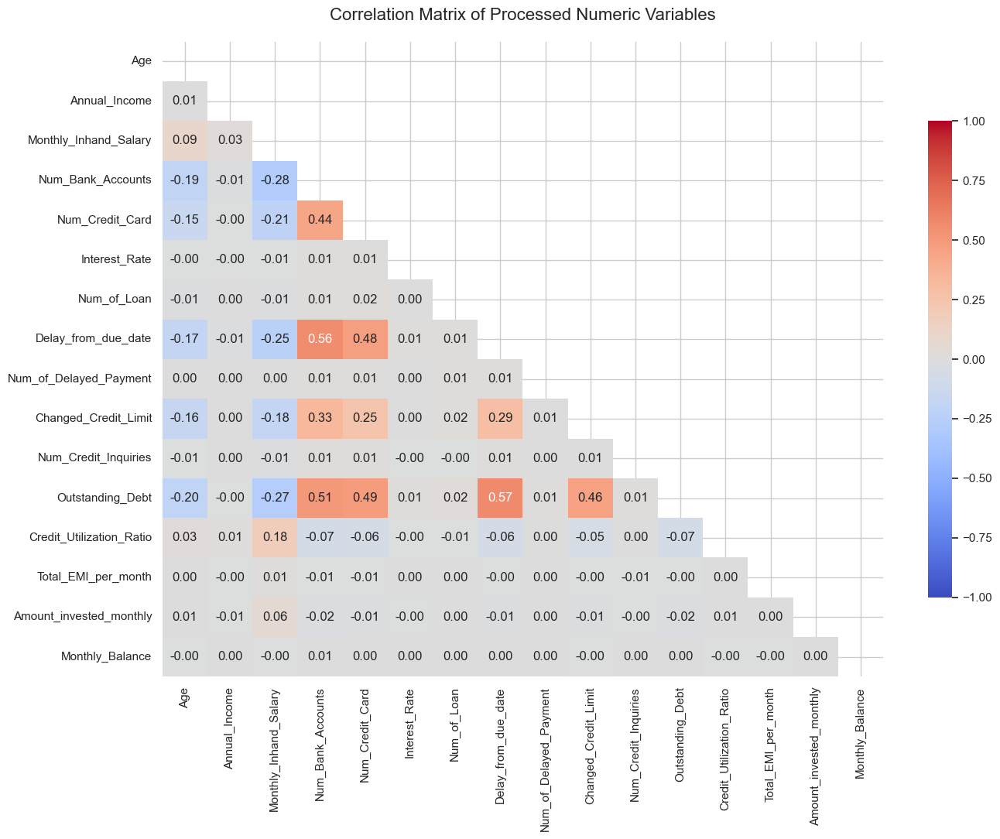
